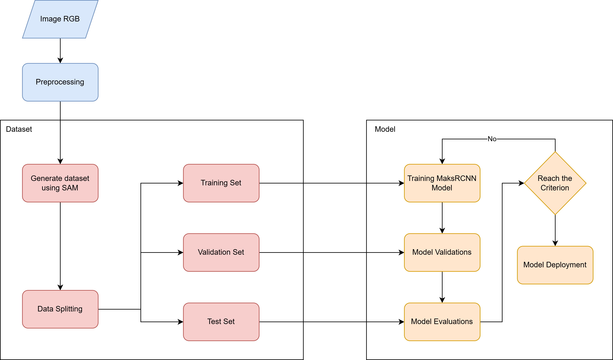

# maskrcnn-yieldsage
Mask R-CNN (Mask Regional Convolutional Neural Network) adalah model deep learning yang digunakan untuk tugas instance segmentation. Instance segmentation adalah proses di mana objek dalam gambar tidak hanya dikenali dan dilokalisasi, tetapi juga dipisahkan masing-masing pikselnya (mask) untuk setiap objek. Mask R-CNN memperluas model Faster R-CNN dengan menambahkan cabang untuk prediksi mask pada setiap Region of Interest (RoI), selain cabang yang sudah ada untuk klasifikasi dan regresi bounding box.
## Arsitektur MaskRCNN
